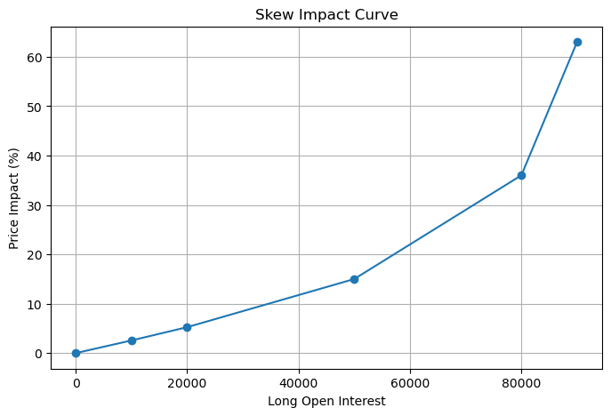
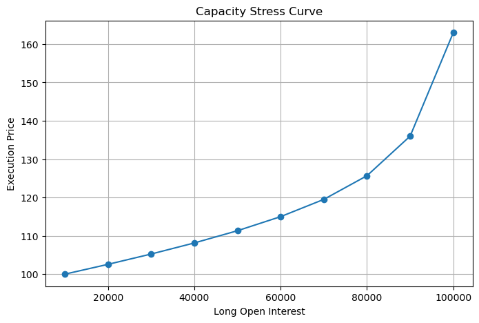
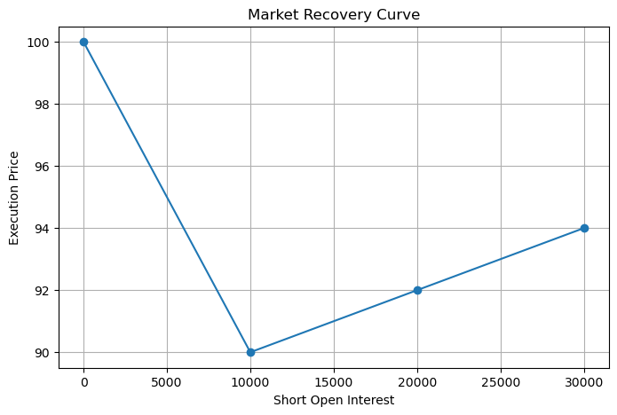

# All Perps-Inspired AMM Research Prototype

## 1. Problem Statement

Traditional perpetual exchanges need to handle:

- Directional imbalance
- Market capacity
- Trader risk
- Liquidation

A market with excessive LONG or SHORT demand can expose the protocol to inventory imbalances and risk.

This project explores how an AMM-inspired pricing model can respond to directional imbalance and capacity utilization.

## 2. Prototype Objective

Build an off-chain AMM simulation that adjusts pricing based on:

1. Market skew
2. Capacity utilization

The objective is to study whether these mechanisms can:

- Increase execution costs as directional imbalance grows.
- Enforce a configured market capacity boundary.
- Allow opposite-side trading to reduce net skew.
- Explore how pricing parameters affect market behavior.

## 3. Architecture

```text
                 Trade Request
                       |
                       v
                Trade Simulator
                       |
        +--------------+--------------+
        |                             |
        v                             v
    AMM Pricing                  Risk Engine
        |                             |
        v                             v
   Market State              Margin / Liquidation
                       |
                       v
                Position Manager
```

The prototype separates pricing, market state, trade simulation, and risk management into distinct components.

## 4. Pricing Model

### 4.1 Skew Impact

**Purpose:** Increase price impact as directional imbalance grows.

The prototype calculates net skew as:

```text
skew = longOpenInterest - shortOpenInterest
```

The skew ratio is:

```text
skewRatio = skew / maxCapacity
```

The skew impact is:

```text
skewImpact = skewCoefficient * abs(skewRatio)
```

**Expected behavior:**

Greater absolute directional imbalance produces greater skew impact, all else being equal.

### 4.2 Capacity Impact

**Purpose:** Increase price impact as total open interest approaches the configured capacity limit.

Capacity utilization is calculated as:

```text
totalOpenInterest = longOpenInterest + shortOpenInterest

usage = totalOpenInterest / maxCapacity
```

The capacity impact is:

```text
capacityImpact = capacityCoefficient * (usage / (1 - usage))
```

The impact increases nonlinearly as utilization approaches 100%.

The implementation throws a `CAPACITY_REACHED` error when utilization is at or above 1.

### 4.3 Execution Price

The prototype combines the two impacts:

```text
totalImpact = skewImpact + capacityImpact
```

The execution price is calculated as:

```text
LONG price = indexPrice * (1 + totalImpact)

SHORT price = indexPrice * (1 - totalImpact)
```

These formulas describe the experimental pricing rules implemented in the off-chain simulation. They are not presented as the exact formulas of the All Perps paper.

## 5. Experiments

### Experiment 1: Skew Impact

**Question:** Does increasing directional imbalance increase trading cost?

**Results:**

| Exposure | Reported Impact |
|---:|---:|
| 0 | 0% |
| 10k | 2.56% |
| 20k | 5.25% |
| 50k | 15% |
| 80k | 36% |
| 90k | 63% |



**Conclusion:**

Under the tested configuration, reported impact increases as directional exposure grows.

The result illustrates how the experimental skew-based pricing mechanism responds to increasing imbalance.

### Experiment 2: Capacity Stress Test

**Question:** Does the prototype enforce a configured capacity boundary?

**Results:**

| Exposure | Result |
|---:|---|
| 100,000 | Accepted |
| 110,000 | Rejected |



**Conclusion:**

The prototype accepts exposure up to the tested capacity boundary and rejects the next tested trade.

This demonstrates the configured capacity enforcement in the tested scenario. It does not establish a general guarantee of protocol solvency.

### Experiment 3: Market Recovery

**Question:** Can opposite-side trading reduce directional imbalance?

**Initial state:**

- LONG OI = 50,000
- SHORT OI = 0
- Index price = 100

**Configuration:**

- Maximum capacity = 100,000
- Skew coefficient = 0.2
- Capacity coefficient = 0

**Results:**

| SHORT Trade | Skew Before | Skew After | Execution Price |
|---:|---:|---:|---:|
| 10,000 | 50,000 | 40,000 | 90 |
| 10,000 | 40,000 | 30,000 | 92 |
| 10,000 | 30,000 | 20,000 | 94 |



**Conclusion:**

Opposite-side trading reduces net skew from 50,000 to 20,000.

Under the tested configuration, the SHORT execution price moves from 90 to 94, closer to the index price of 100.

**Limitation:**

This is a simplified off-chain simulation. The experiment demonstrates reduced net skew and a change in the modeled execution price, not guaranteed market recovery or solvency.

### Experiment 4: Parameter Analysis

#### 4.1 Skew Coefficient

**Question:** How does the skew coefficient affect reported price impact?

| Skew Coefficient | Reported Impact |
|---:|---:|
| 0.05 | 4% |
| 0.2 | 16% |
| 0.5 | 40% |
| 1.0 | 80% |

**Finding:**

Under the tested conditions, increasing the skew coefficient increases the reported impact.

This indicates that the coefficient controls the strength of the skew-based pricing response.

#### 4.2 Capacity Coefficient

**Question:** How does the capacity coefficient affect reported price impact?

| Capacity Coefficient | Reported Impact |
|---:|---:|
| 0.01 | 4% |
| 0.05 | 20% |
| 0.1 | 40% |
| 0.2 | 80% |

**Finding:**

Under the tested conditions, increasing the capacity coefficient increases the reported impact near the utilization limit.

This indicates that the coefficient controls the strength of the capacity-based pricing response.

## 6. Current Limitations

The current prototype is an off-chain simulation inspired by the All Perps paper.

It does not yet implement or fully model:

- On-chain AMM TWAP integration.
- Oracle manipulation and oracle security.
- Funding rate mechanisms.
- LP accounting and profit/loss.
- Insurance fund mechanisms.
- Liquidation incentives.
- Real blockchain execution.
- A complete protocol-level solvency model.

The pricing formulas, coefficients, and experimental configurations are implementation choices. The prototype should not be treated as a faithful reproduction of the complete All Perps design.

## 7. Future Work

Possible extensions include:

1. Implement a funding rate mechanism.
2. Add LP profit/loss accounting and simulation.
3. Explore alternative AMM pricing curves.
4. Compare the prototype's mechanisms with existing perpetual protocols.
5. Integrate an oracle TWAP mechanism.
6. Develop an on-chain implementation.
7. Expand risk and solvency testing across different market scenarios.

## 8. Summary

This project explores an AMM-inspired perpetual market simulation using skew-based and capacity-based pricing.

The experiments investigate how directional imbalance, capacity utilization, and parameter changes affect modeled execution prices and exposure.

The results provide a foundation for further research into pricing behavior, risk management, and market capacity in perpetual trading systems.